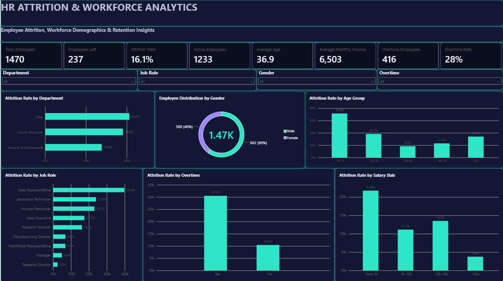

# HR-Analytics-Dashboard

A Power BI dashboard designed to analyze employee attrition, workforce demographics, salary patterns, job roles, departments, and overtime behavior.

The project transforms raw HR employee data into an interactive, business-focused dashboard that helps identify workforce segments with higher attrition rates and supports data-driven retention decisions.

---

## 📊 Dashboard Preview



---

## 🎯 Project Objective

The objective of this project is to analyze employee attrition and identify workforce patterns that may help HR teams understand:

- Which departments experience higher employee attrition
- Which age groups are more likely to leave
- Which job roles have higher attrition rates
- The relationship between overtime and employee attrition
- How salary bands relate to attrition
- Overall workforce composition and employee demographics

---

## 🛠️ Tools & Technologies

- **Power BI Desktop**
- **Power Query**
- **DAX**
- **CSV / Excel Data**
- Data Cleaning & Transformation
- Data Visualization
- HR Analytics

---

## 📁 Project Files

| File | Description |
|---|---|
| `HR Analytics Dashboard.pbix` | Power BI dashboard and data model |
| `HR_Analytics.csv` | Raw HR employee dataset |
| `HR_Attrition_Workforce_Analytics.pdf` | Exported dashboard |
| `dashboard.png` | Dashboard preview image |

---

## 🔄 Data Preparation

The raw HR dataset was cleaned and prepared using Power Query before building the dashboard.

### Data Cleaning Steps

- Removed duplicate employee records
- Removed unnecessary columns
- Renamed columns for readability
- Corrected inconsistent categorical values
- Handled missing values
- Standardized data types
- Created a salary-band sorting column
- Validated numerical ranges and logical relationships

The final dataset contains **1,470 unique employees**.

---

## 📐 DAX Measures

The dashboard uses DAX measures to calculate key workforce KPIs.

### Total Employees

```DAX
Total Employees =
DISTINCTCOUNT('HR_Analytics'[Employee ID])
Employees Left
Employees Left =
CALCULATE(
    [Total Employees],
    'HR_Analytics'[Attrition] = "Yes"
)
Active Employees
Active Employees =
CALCULATE(
    [Total Employees],
    'HR_Analytics'[Attrition] = "No"
)
Attrition Rate
Attrition Rate =
DIVIDE(
    [Employees Left],
    [Total Employees],
    0
)
Average Age
Average Age =
AVERAGE('HR_Analytics'[Age])
Average Monthly Income
Average Monthly Income =
AVERAGE('HR_Analytics'[Monthly Income])
Overtime Employees
Overtime Employees =
CALCULATE(
    [Total Employees],
    'HR_Analytics'[Overtime] = "Yes"
)
Overtime Rate
Overtime Rate =
DIVIDE(
    [Overtime Employees],
    [Total Employees],
    0
)
📊 Dashboard KPIs
KPI	Value
Total Employees	1,470
Active Employees	1,233
Employees Left	237
Attrition Rate	16.1%
Average Age	36.9
Average Monthly Income	6,503
Overtime Employees	416
Overtime Rate	28%
🔎 Key Insights
1. Sales has the highest department attrition
Sales: 20.6%
Human Resources: 19.0%
Research & Development: 13.8%

Sales has the highest attrition rate among the three departments.

2. Younger employees show higher attrition

The 18–25 age group has the highest attrition rate at 35.8%.

Age Group	Attrition Rate
18–25	35.8%
26–35	19.1%
36–45	9.2%
46–55	11.5%
55+	17.0%
3. Sales Representatives have the highest role-level attrition

The Sales Representative role has the highest attrition rate at 39.8%.

Other relatively high-attrition roles include:

Laboratory Technician — 23.9%
Human Resources — 23.1%
Sales Executive — 17.5%
4. Overtime is associated with substantially higher attrition

Employees working overtime have an attrition rate of 30.5%, compared with 10.4% for employees who do not work overtime.

This represents a difference of approximately 20.1 percentage points.

5. Lower salary bands show higher attrition
Salary Slab	Attrition Rate
Upto 5k	21.8%
5k–10k	11.1%
10k–15k	13.5%
15k+	3.8%

The lowest salary band has the highest attrition rate, while the 15k+ salary band has the lowest.

💡 Business Recommendations

Based on the dashboard analysis, HR teams could consider:

Strengthening retention programs for early-career employees
Reviewing workload and overtime patterns
Investigating retention challenges within Sales
Evaluating career progression opportunities for high-attrition roles
Reviewing compensation competitiveness for lower salary bands
Using workforce analytics regularly to identify emerging attrition risks

Note: The dashboard identifies associations and patterns in the data. These relationships should not automatically be interpreted as proof of causation.

🎛️ Interactive Dashboard Features

The dashboard includes interactive slicers for:

Department
Job Role
Gender
Overtime

Users can filter the dashboard dynamically and analyze how workforce and attrition metrics change across different employee segments.

📈 Visualizations

The dashboard contains:

KPI Cards
Attrition Rate by Department
Employee Distribution by Gender
Attrition Rate by Age Group
Attrition Rate by Job Role
Attrition Rate by Overtime
Attrition Rate by Salary Slab
🚀 How to Use
Download the repository.
Open HR Analytics Dashboard.pbix using Power BI Desktop.
If required, update the CSV data source path.
Refresh the dataset.
Use the slicers to explore employee attrition patterns.
👨‍💻 Author

Samir More

B.Tech — Computer Science Engineering (Artificial Intelligence & Analytics)

Connect
GitHub: https://github.com/samirmore7
Portfolio: https://samirmoreportfolio.netlify.app/
⭐ Project Highlights

This project demonstrates practical skills in:

Power BI | DAX | Power Query | Data Cleaning | Data Visualization | Business Intelligence | HR Analytics
